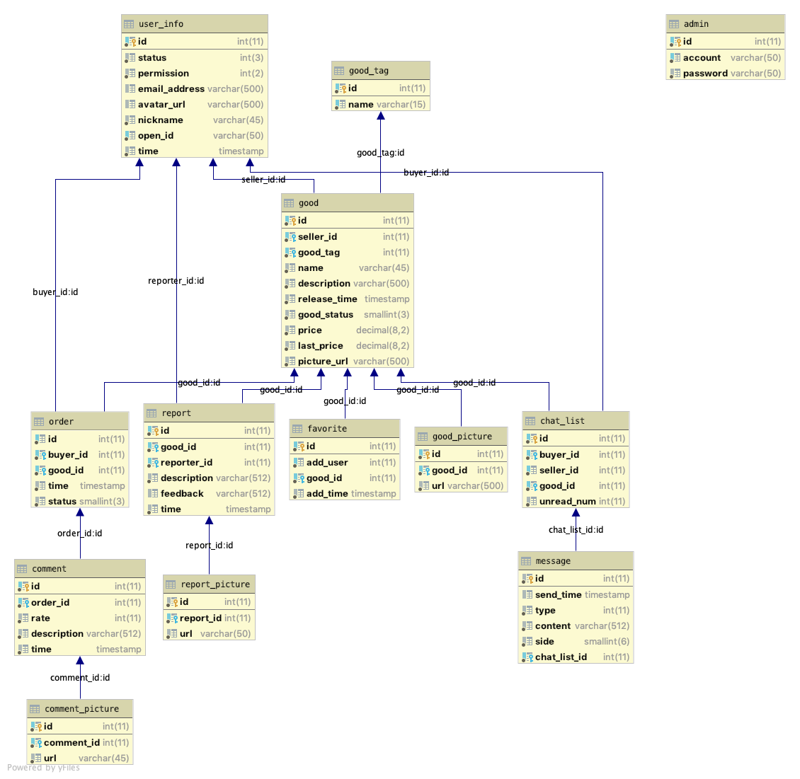

# 懒猫二手交易市场（后端）

本项目基于springboot，数据库相关采用mybatis

## 代码结构

1. config：
   - 对mybatis的设定（数据库类型，数据库地址）
   - web相关配置
   - 自动处理transaction（采用c3p0）
2. dao (data access object):
   - 所有数据库相关操作的接口
3. entity：实体类，数据库对应的实体
4. handler：与微信小程序api之间的操作，主要是拿到openid
5. tools：工具类
   - EmailUtil：邮箱验证（服务器将会发个邮件过去）
   - GT：Google translate
   - HttpClientUtil：封装http请求 [source](https://github.com/leechenxiang/imooc-springboot-wxlogin/blob/master/src/main/java/com/imooc/common/HttpClientUtil.java>) 
   - RandomGoods：生成14个随机的商品
   - Search：搜索，支持多个关键词搜索（以空格分开），并选取匹配程度最高的2000条，然后支持按多种键值排序，并支持价格区间筛选
6. web.Controllers：前端相关Controllers

## 数据库定义 



//TO-DO


## 搜索相关

定义在`tools.Search`

1. 对关键词搜索（默认按匹配度排序）

   每一页返回20条，如果page小于1则返回前2000条

   ```java
   List<Good> search(List<String> keywords, Integer page);
   ```

2. 分类对关键词搜索（默认按匹配度排序）

   每一页返回20条，如果page小于1则返回前2000条

   ```java
   List<Good> search(List<String> keywords,Integer tag,Integer page);
   ```

3. 对搜索结果按多种指标排序，传入一个String类型表示是按照时间还是按照价格排序，boolean值表示是否按照降序。low和up表示商品价格的上界和下届（如果传入两个负数，默认值是0和0x3f3f3f3f）
   带有tag的与不带tag的实现基本一致(keywords后面多了一个tag参数)，这里以不带tag的为例：
   ```java
   public List<Good> search(List<String> keywords, Integer page, String sortKey,boolean decrease,float low,float up);
   ```
   

